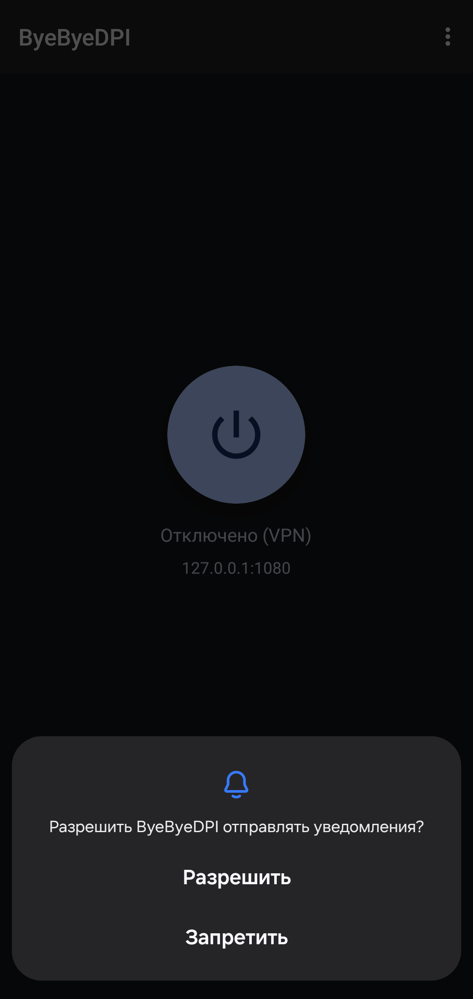
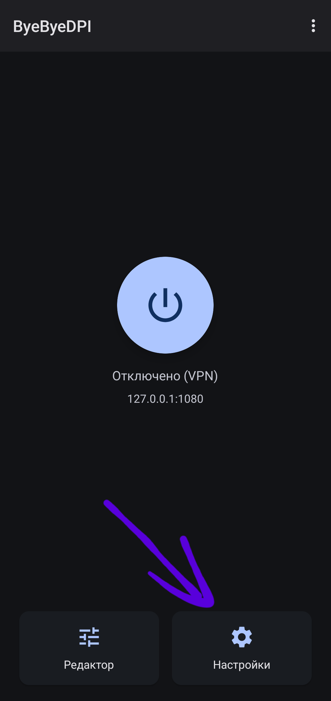
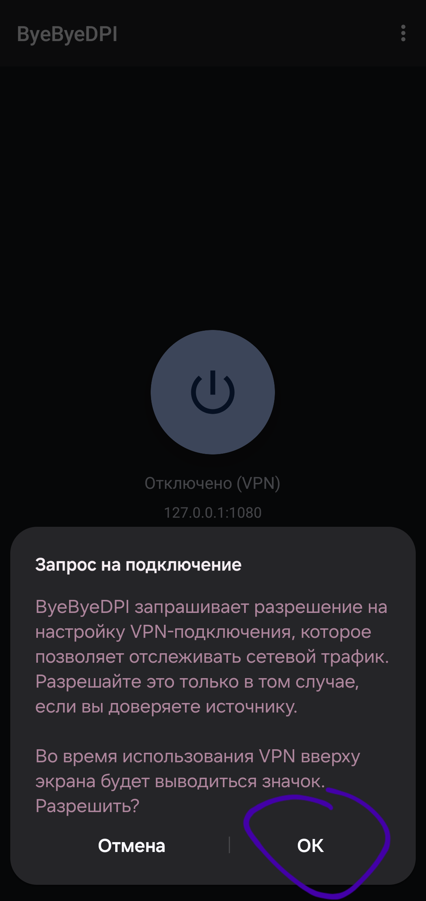
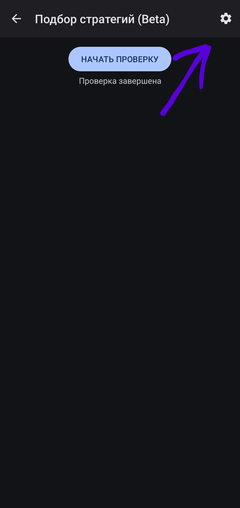
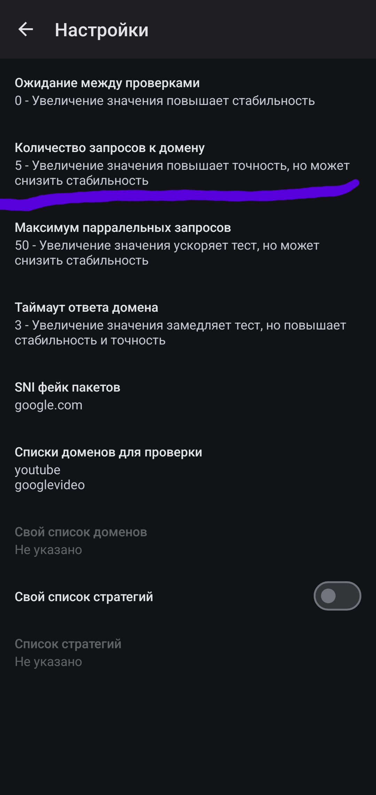
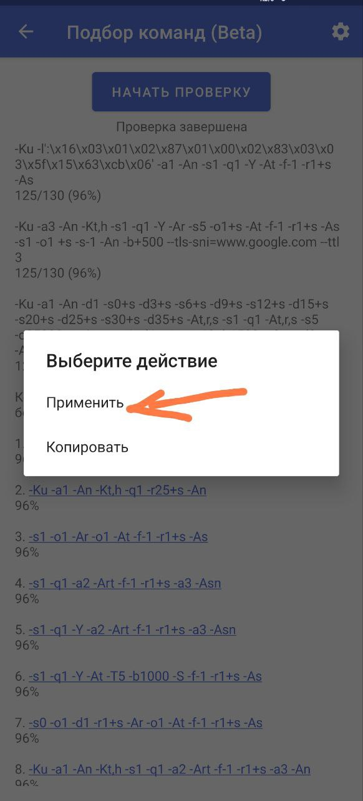

## <a id="what-is-ByeByeDPI">Что такое ByeByeDPI?</a>

> _**[ByeByeDPI](https://github.com/romanvht/ByeDPIAndroid?tab=readme-ov-file)**_ или сокращённо **bbd** - приложение для **Android**, которое локально запускает _[ByeDPI](https://github.com/hufrea/byedpi)_ и перенаправляет весь трафик через него.

Для работы приложения требуется **Андроид 6** и более новые версии.
Приложение работает **только** на Android и Android TV, а также некоторых прошивках, основанных на Android.

**Не существует** версии для iOS, TizenOS, WebOS, Windows, MacOS, Linux, FreeBSD и т.д.
Если у вас система, не подходящая для установки ByeByeDPI, и вы по каким-то причинам не хотите использовать VPN или прокси - рассмотрите другие варианты в разделе [Другое](others.md#other-options) (в этом разделе также есть варианты установки zapret в качестве модулей Magisk).

> [!IMPORTANT]
> Приложение **не является VPN** - обойти региональные блокировки (например, получить доступ к ChatGPT) при помощи ByeByeDPI **нельзя**!
> ByeByeDPI использует VPN-режим на Android для перенаправления трафика, но не передает информацию на удаленный сервер. Оно не шифрует трафик и не скрывает ваш IP-адрес.

_А если всё-таки очень хочется получить доступ к ИИ-сервисам и некоторым другим ресурсам без VPN - читайте про [специальный DNS](others.md#proxy-dns)._

Про механизмы блокировок более подробно можно узнать здесь:

- [Видео с канала Мой Компьютер](https://www.youtube.com/watch?v=vZhU7nrWRLc)
- [Интервью с ValdikSS](https://www.youtube.com/watch?v=bZxEU_kvP_I)
- [Официальная документация Zapret](https://github.com/bol-van/zapret)
- [Evolving Censorship Evasion Strategies](https://geneva.cs.umd.edu/papers/geneva_ccs19.pdf)
- [Censorship research publications](https://ntc.party/c/censorship-research-publications/22)

## <a id="how-to-use-ByeByeDPI">Как пользоваться ByeByeDPI?</a>

Для начала, конечно, требуется скачать приложение. Приложение имеет стандартное расширение `apk`.

> [!NOTE]
> В релизах находятся файлы под разные архитектуры. Если не знаете архитектуру своего процессора - скачивайте `universal`.

> [!WARNING]
> Приложение **полностью** бесплатно, автор не несёт ответственности, если вы переводите за приложение деньги третьим лицам. Разработчик также не несёт ответственности за версии, скачанные не из официального источника. 
> **Скачивать** приложение нужно **только** из официального репозитория:
> последняя на данный момент версия находится **[здесь](https://github.com/romanvht/ByeDPIAndroid/releases)**.

Так как механизм работы ByeByeDPI отличен от VPN, приложение **требует настройки**.

> [!IMPORTANT]
> Перед настройкой ByeByeDPI установите или обновите официальный клиент YouTube до последней версии.
> Не проверяйте работу ByeByeDPI на неофициальных клиентах, так как это не может гарантировать правильность проверки, что повлечет проблемы с дальнейшей настройкой.

Проверять и настраивать неофициальные клиенты необходимо только после того, как вы убедитесь, что официальное приложение YouTube работает. Это справедливо и для других приложений: например, **YouTube Music**.

### <a id="before-setting">До настройки</a>

Всё чаще приходят жалобы на [перехват DNS](https://ru.wikipedia.org/wiki/DNS_hijacking). Чтобы определить, какой DNS-сервер вы используете, откройте этот [сайт](https://browserleaks.com/dns). Для обеспечения корректной работы ByeByeDPI авторы данного руководства рекомендуют настроить [DNS over TLS](https://ru.wikipedia.org/wiki/DNS_%D0%BF%D0%BE%D0%B2%D0%B5%D1%80%D1%85_TLS) на уровне всей системы (стоит отметить, что такая возможность есть только на устройствах под управлением Android 9+).

> [!WARNING]
> В связи с текущей ситуацией с некоторыми DNS-серверами могут возникать проблемы (как, например, с DNS от Cloudflare). Лучше протестировать DNS самостоятельно при помощи _DNS Jumper_ и _GRC's DNS Benchmark_.

> [!NOTE]
> Будьте внимательны при выборе DNS, так как некоторые DNS блокируют доступ к сайтам, считая их рекламой или взрослым контентом.

Проверенные DNS over TLS:

- `dns.google`
- `unfiltered.adguard-dns.com`
- `dot.sb`
- больше DoT [здесь](https://dnsprivacy.org/public_resolvers/#dns-over-tls-dot) и [здесь](https://adguard-dns.io/kb/ru/general/dns-providers/)

Укажите в системе частный DNS:


DNS over HTTPS можно найти [здесь](https://github.com/curl/curl/wiki/DNS-over-HTTPS) или [здесь](https://dnscrypt.info/public-servers/), однако нужно учитывать, что DoH не поддерживается на уровне системы Android.

### <a id="setting">Настройка</a>

Для эффективной работы ByeByeDPI требуется правильная настройка:
> [!WARNING]
> Выполнить настройку необходимо до конца, дабы избежать различных ошибок в пользовании приложением.
- Разрешите показ уведомлений

  - 

- Прежде чем нажать кнопку **Подключить**, зайдите в **_основные настройки ByeByeDPI_** (шестерёнка справа, внизу экрана):

  - 

- Активируйте переключатель «Использовать командную строку»

  - 

- В пункте **Фильтр приложений** выберите режим **белого списка** ([подробнее про списки](features.md#whitelist-blacklist))

    - 
    
- В пункте **«Выбрать приложения»** отметьте **официальный клиент YouTube** и другие приложения, которые должны работать через ByeByeDPI

    -     
    
- Выйдите из настроек и подключитесь, нажав на большую кнопку посередине экрана. Выдайте разрешение на поднятие VPN-соединения - это нужно для работы приложения.
  
  - 

Основная настройка на этом этапе закончена. 

Дальнейшая настройка будет полезна тем, у кого перестал работать необходимый сервис (YouTube, к примеру, так как дальнейшая настройка делается под него).

- Перейдите в пункт «Подбор стратегий (Beta)»[^1]
    - 

- Перейдите в **настройки подбора** (шестерёнка справа сверху)

  - 

- Измените **Количество запросов к домену** на 5

  - 

- Вернитесь в пункт **Подбор команд (Beta)** и нажмите на кнопку «Начать проверку»


- Дождитесь окончания подбора. Об успешном окончании будет свидетельствовать строка ```Проверка завершена```. Стратегии сортируются по количеству ответивших доменов автоматически. Вылетает подбор - решение [здесь](problems.md#crash-proxy-test).

  - 

- Нажмите на стратегию с наиболее частым ответом доменов[^2] (она будет в самом верху подбора), и выберите ```Применить и запустить``` в появившемся меню.

  - 

- Проверьте работу сервиса. Если результат неудовлетворителен (сервис не отвечает/отвечает долго), повторите предыдущий пункт, однако со следующей стратегией в списке.    

На этом настройка завершена.

Если в подборе стратегий не нашлось стратегии, которая бы давала доступ к вашему сервису, рассмотрите возможность [подбора пользовательских стратегий](features.md/#my-list). Стратегии для него можно взять в [Telegram-группе ByeByeDPI](https://t.me/byebyedpi_group), или в других местах интернета.

---

[^1]: Подбор команд находится в разработке. Могут быть ошибки. **Стратегии не генерируются автоматически** - они всегда одни и те же. В текущей реализации подбор по сути ничего не подбирает - он просто проверяет работу набора стратегий, которые были добавлены в него разработчиком.

[^2]: Общий показатель ответа доменов **не является** прямой зависимостью от работы сервиса. У каждого сервиса есть свой набор доменов, часть из которых - критически важна для работы, а без другой части сервис может обойтись. Например, тот же YouTube будет работать, если не отвечает домен `ggpht.com` - вы просто лишитесь превью; напротив, при отсутствии ответа от `googlevideo.com` вы не сможете смотреть видео.
