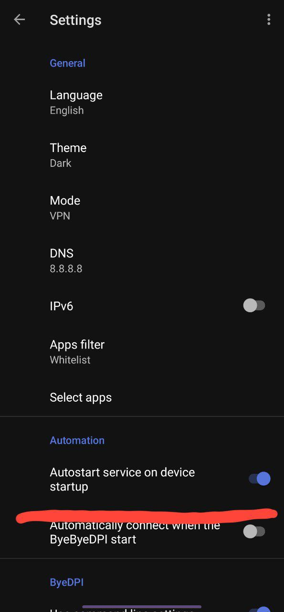
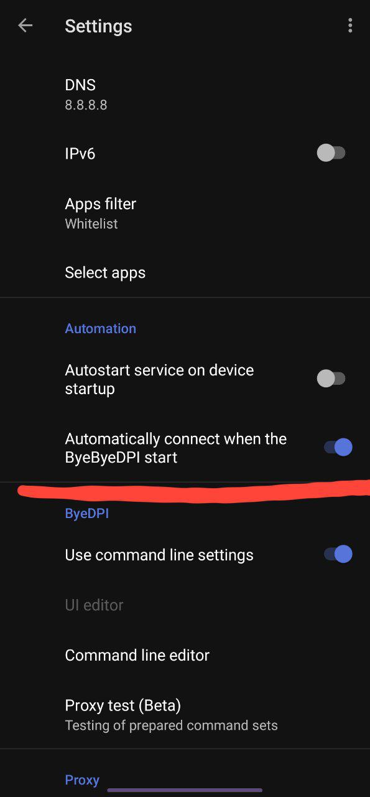

# <a id="тв-приставки">Additional settings for Android TV and TV-boxes running Android</a>

> [!WARNING]
> It is important to configure application according to [standard instruction](start.en.md) first.

1. [Send ByeByeDPI to TV](#send-to-tv)
2. [Export current settings onto TV](#transfer-to-tv)
3. [Autostart](#autostart)
4. [Autoconnect](#autoconnect)
5. [SberBOX/SlimBox setup](sbox.en.md)
6. [TCL setup](#tcl)

## <a id="send-to-tv">Send ByeByeDPI to TV</a>

To easily send ByeByeDPI to TV, you can use these applications `Send Files To TV` or `Easy Fire Tools`.

## <a id="transfer-to-tv">Export current settings onto TV</a>

If you already have a device with ByeByeDPI installed and successfully configured **in the same network as your TV**, you can export its settings.

The simplest method is built-in [export and import](features.en.md#export-import) feature.
But it doesn't work on some firmwares. In this case you can use AirMouse (or a remote with embedded keyboard) to manually print commandline arguments.
There is also applications like `Zank Remote` or `Serverless Bluetooth Keyboard & Mouse`, which let you use your smartphone as a remote.

These are also helpful: `Android TV ADB Mouse Keyboard`, GoogleTV remote and `Android TV Remote Control`.

## <a id="autostart">Autostart</a>

Automatically starts ByeByeDPI **_on device startup_**. It is meant to be used in pair with **[whitelist](features.en.md#whitelist-blacklist)** only.



## <a id="autoconnect">Autoconnect</a>

Automatically starts ByeByeDPI on its opening.



## <a id="slim-sber">SberBOX/SlimBox setup</a>

Instruction [here](sbox.en.md)

## <a id="tcl">TCL setup</a>

_Instruction made by @karlosu (in Telegram)_

If you have TCL TV and trying to turn on VPN throws an error:

- Update your firmware to the latest version in your TV settings.
- Run Proxy test and apply the strategy with the highest domain response (see [this page](start.en.md)).
- In the Command line editor write this:
```
-i 127.0.0.1 -p 1080 (your strategy)
```
- Try to connect.
- If it hadn't helped you, you'll need to see [this solution](problems.en.md#no-vpn) since your device blocks VPN
